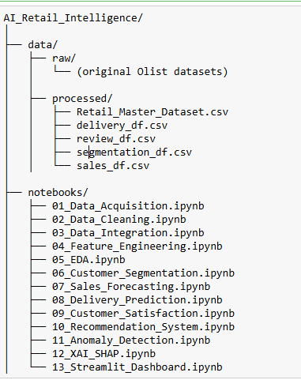
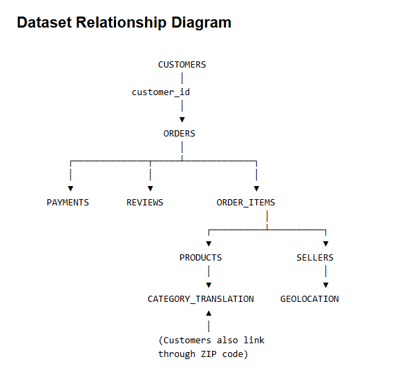

# NovaMart AI Retail Intelligence Platform
NovaMart AI Retail Intelligence Platform: End-to-End Machine Learning for E-Commerce Analytics
An end-to-end AI-powered retail analytics platform built with Python and machine learning for customer segmentation, sales forecasting, delivery delay prediction, recommendation systems, anomaly detection, explainable AI (SHAP), and an interactive Streamlit dashboard.
## The Problem
NovaMart is a multinational e-commerce company. it as a company similar to Amazon or Shopee. It operates a large online marketplace with thousands of products across many categories, serves a substantial customer base, and processes a high volume of transactions every day.
But like many growing e-commerce companies, NovaMart faces six key analytical challenges:
— It has no way to distinguish between its most valuable customers and one-time buyers.
— It cannot reliably forecast future sales, making inventory and budgeting difficult.
— Delivery delays go undetected until a customer complains.
— There's no personalised product recommendation engine.
— Suspicious transactions aren't flagged automatically.
— And when an AI model makes a prediction, there's no way to explain why which erodes trust with business stakeholders.
Each of these challenges maps directly to one of the nine platform modules. That's the business story that ties this whole project together.

## The Dataset
The dataset powering this entire platform is the Olist Brazilian E-Commerce real dataset, freely available on Kaggle.
What makes Olist particularly well-suited for this project is its scale and structure. It contains over 100,000 real customer orders and is spread across nine interlinked tables — orders, customers, products, sellers, payments, reviews, geolocation, delivery dates, and order status.
This isn't a single flat CSV file. It's a relational database structure, which means working with it requires real data engineering skills — joining tables, resolving foreign keys, handling nulls across multiple sources. That alone makes it more realistic than most academic datasets.
More importantly, the richness of nine tables means a single dataset can support almost every type of ML task: clustering for segmentation, regression for forecasting, classification for delivery and satisfaction prediction, association rules for recommendations, and anomaly detection for fraud.
One dataset. No dataset juggling. One coherent business story.

## System Architecture



## Dataset Relationship Diagram



*Figure 1. End-to-end architecture of the NovaMart AI Retail Intelligence Platform, showing data ingestion, preprocessing, machine learning modules, explainable AI, and dashboard deployment.*

## Technologies

- Python
- Pandas
- NumPy
- Scikit-learn
- XGBoost
- TensorFlow
- SHAP
- Streamlit
- Plotly

├── data
├── notebooks
├── app
├── models
├── images
├── requirements.txt
└── README.md

git clone https://github.com/yourusername/novamart-ai-retail-intelligence.git

cd novamart-ai-retail-intelligence

pip install -r requirements.txt

## Results

- Model comparison table
- Accuracy metrics
- Dashboard screenshots
- SHAP explanations

---

## Dataset

This project uses the Olist Brazilian E-Commerce Dataset.

To download:

```python
import kagglehub

path = kagglehub.dataset_download(
    "olistbr/brazilian-ecommerce"
)


